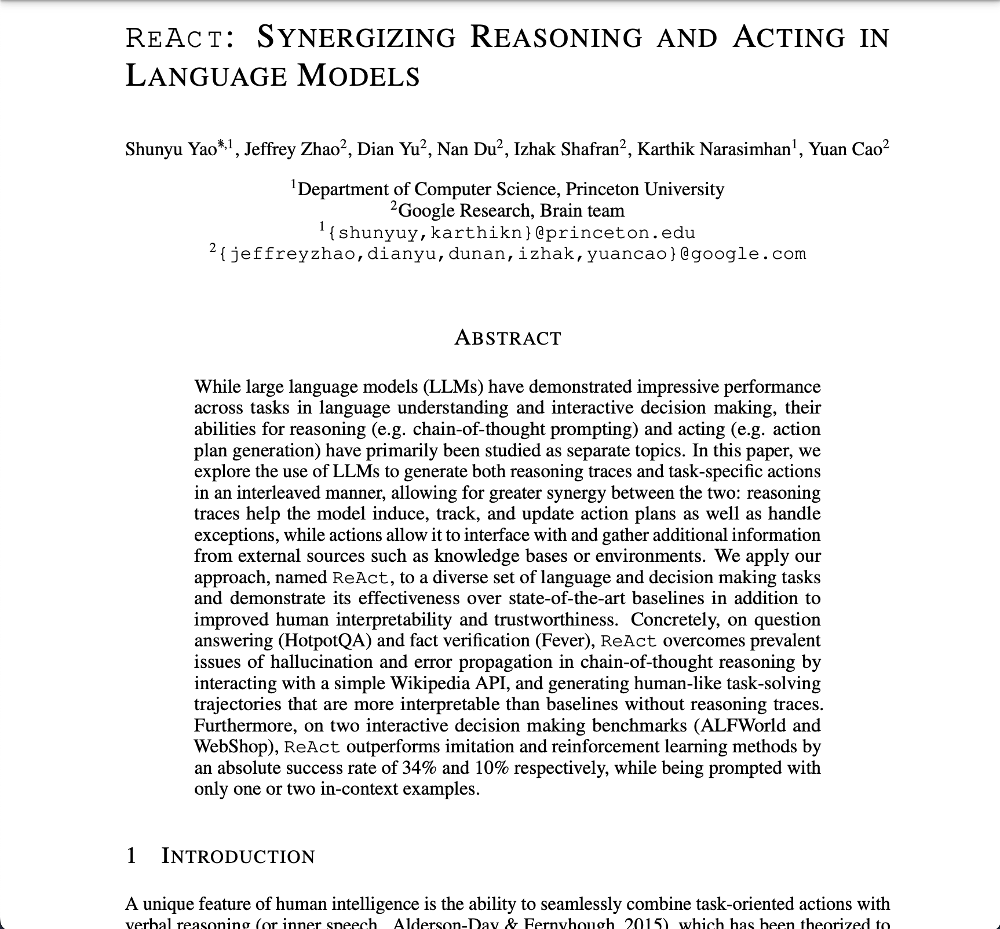
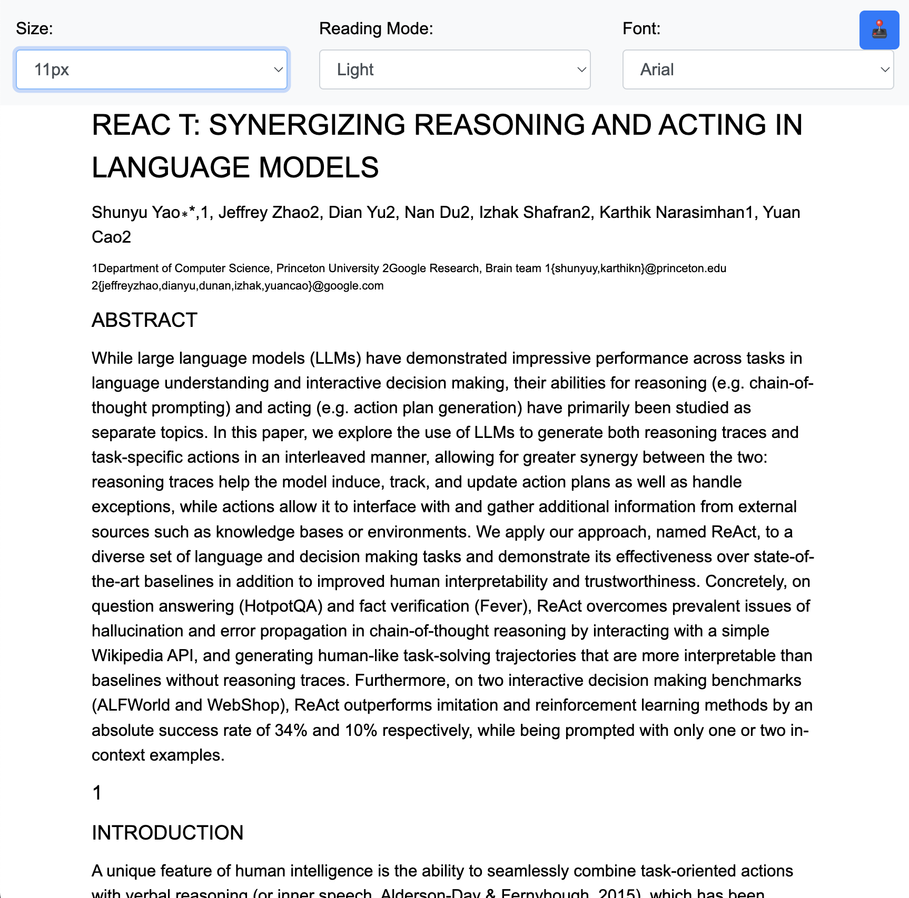

# PDF to HTML Converter

This project provides a Python script that converts PDF files to HTML, preserving the original formatting and allowing for dynamic font size adjustments. It's particularly useful for making PDF content more accessible and readable on various devices.

## Demo
| Before Conversion | After Conversion |
|-------------------|------------------|
|  |  |

➡️ Try it out here: [Sample HTML](https://phyous.github.io/pdf_to_html/output.html)

## Features

- Converts PDF files to HTML while maintaining the original structure
- Preserves original text and font sizes from the PDF
- Includes a dynamic font size selector for improved readability
- Utilizes Bootstrap for a responsive and mobile-friendly design
- Logs processing information for easy debugging

## Requirements

- Python 3.10+
- Poetry (for dependency management)

## Installation

1. Ensure you have Poetry installed. If not, install it by following the instructions at [https://python-poetry.org/docs/#installation](https://python-poetry.org/docs/#installation)

2. Clone this repository:
   ```
   git clone https://github.com/yourusername/pdf-to-html.git
   cd pdf-to-html
   ```

3. Install the project dependencies using Poetry:
   ```
   poetry install
   ```

This will create a virtual environment and install all the required packages specified in the `pyproject.toml` file.

## Usage

To use the PDF to HTML converter, run the `main.py` script within the Poetry environment:

```
poetry run python main.py -i <input_pdf_file> [-o <output_html_file>]
```

- `-i` or `--input`: Path to the input PDF file (required)
- `-o` or `--output`: Path to the output HTML file (optional, defaults to 'output.html' in the same directory as the input file)

### Example

```
poetry run python main.py -i documents/sample.pdf -o converted/sample.html
```

This command will convert `documents/sample.pdf` to HTML and save the output as `converted/sample.html`.

## How It Works

1. The script parses the PDF file using `pdfminer.six`.
2. It extracts text and font information from each page.
3. The extracted content is converted to HTML using `BeautifulSoup`.
4. A font size selector is added to allow dynamic resizing of the text.
5. Bootstrap is incorporated for responsive design.
6. The resulting HTML file preserves the original text formatting and allows for easy reading on various devices.

## Customization

You can customize the base font size by modifying the `BASE_FONT_SIZE` variable in the `main.py` file. The default value is set to 16.

## Limitations

- This converter focuses on text content and may not preserve complex layouts or images from the original PDF.
- Some PDFs with unusual formatting or security features may not convert accurately.

## Contributing

Contributions to improve the converter are welcome! Please feel free to submit issues or pull requests.

## License

This project is licensed under the MIT License:

MIT License

Copyright (c) 2023 [Your Name or Organization]

Permission is hereby granted, free of charge, to any person obtaining a copy
of this software and associated documentation files (the "Software"), to deal
in the Software without restriction, including without limitation the rights
to use, copy, modify, merge, publish, distribute, sublicense, and/or sell
copies of the Software, and to permit persons to whom the Software is
furnished to do so, subject to the following conditions:

The above copyright notice and this permission notice shall be included in all
copies or substantial portions of the Software.

THE SOFTWARE IS PROVIDED "AS IS", WITHOUT WARRANTY OF ANY KIND, EXPRESS OR
IMPLIED, INCLUDING BUT NOT LIMITED TO THE WARRANTIES OF MERCHANTABILITY,
FITNESS FOR A PARTICULAR PURPOSE AND NONINFRINGEMENT. IN NO EVENT SHALL THE
AUTHORS OR COPYRIGHT HOLDERS BE LIABLE FOR ANY CLAIM, DAMAGES OR OTHER
LIABILITY, WHETHER IN AN ACTION OF CONTRACT, TORT OR OTHERWISE, ARISING FROM,
OUT OF OR IN CONNECTION WITH THE SOFTWARE OR THE USE OR OTHER DEALINGS IN THE
SOFTWARE.